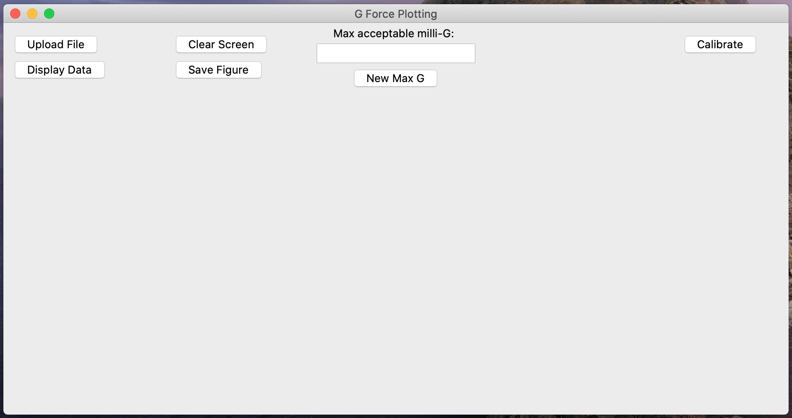
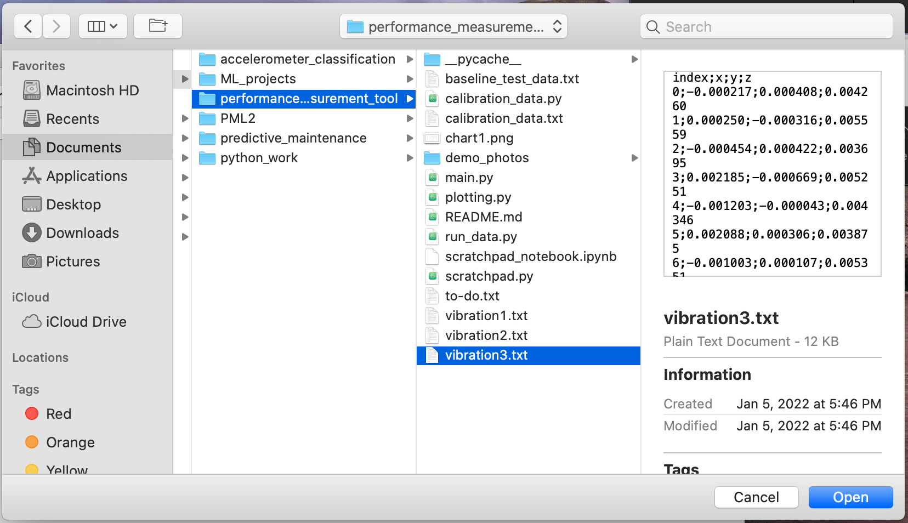
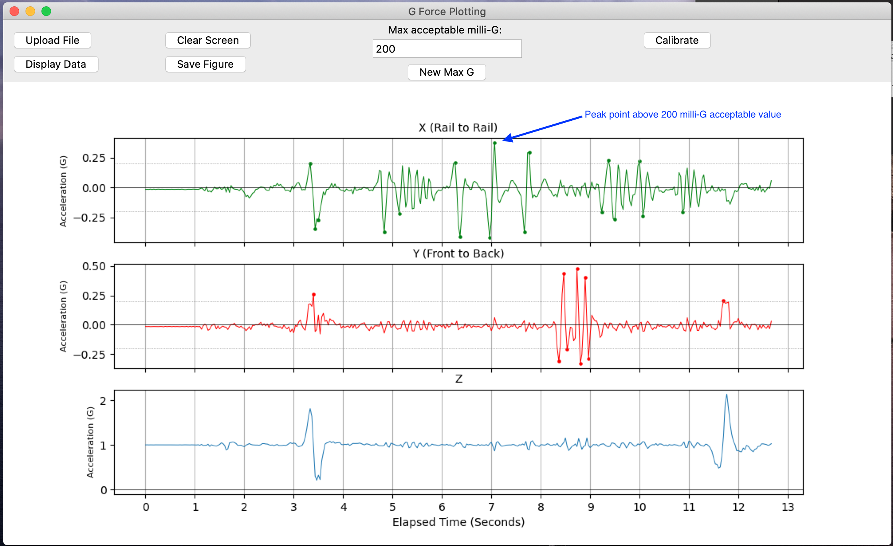

## Performance Measurement Tool (PMT)

### Motivation
In the elevator industry, ride quality is a huge consideration when building new elevators and modernizing existing systems.

In my previous role as a modernization project director, we used a pretty large and heavy device to measure ride quality due to the fact that the manufacturer also provided us with software that would help us download and plot the vibration data. It was cumbersome to carry around and inconvenient to use. **There are MANY iPhone and Android applications that can capture acceleration, so I figured it was time to build a desktop application that could take the data collected from a phone and output nice charts/ visuals.**

### Objectives

1. To build a tool that would eliminate the need to carry heavy equipment when measuring ride quality
2. To get more practice with object oriented programming while building something practical/ useful

### Approach
I used the `tkinter` python library to build a desktop application that reads vibration data collected from an iPhone. It allows the user to select a file of data which has been recorded using an ["Accelerometer" iPhone app built by *DreamArc*.](https://appadvice.com/app/accelerometer/499629589)

The **Performance Measurement Tool** allows a user to input data collected during a ride, upload to a computer, then output a chart that identifies any acceleration values that are too large.1

### How to Use It:
1. Run the `main.py` python script from the repo, which will open up the `tkinter` interface.

2. Click on the "Upload File" button at the top left and select "sample_data >> vibration3.txt" (the others work too, but vibration3.txt is the best example).

3. Click on the "Display Data" Button.

4. Calibrate the data2 by clicking on the "Calibrate" button near the top right of the screen. Select the "calibration_data.txt" file and click "Open."

5. Set the maximum acceptable milli-G values by typing a value into the text box and clicking "New Max G". 3 This wil adjust the horizontal dotted lines on the X and Y axes. All the peak acceleration values that are above or below this threshold will be marked with a circle. Try inputting 200 (which corresponds to .2 G/ 200 milli-G) to see how the graphs adjust to the new acceptable maximum acceleration.

6. Optional: Save the figure by clicking the "Save the Figure" Button, which will save the chart you created as a .png file to your current working directory.

Notes:
1. Ride quality is measured in milli-G, which represents an acceleration value that is felt by riders inside an elevator as it goes up or down. A ride with a maximum value of 11 milli-g in any direction is considered very smooth, but this can only be achieved with state of the art equipment. Measurements in the 20s are more reasonable.
2. All phones are different, so it's necessary to create a calibration file that will represent the values a phone picks up when it is just sitting on a still surface (they can be up to 3 milli-G as a result of any building vibrations, etc.). This will make sure that the acceleration values are not inflated when analyzing.
3. I didn't have access to elevator data when building this app due to COVID, so I just simulated data by holding the phone and shaking it back and forth slightly. It's therefore MUCH higher than you could expect from an elevator ride. I also did my best to record vertical acceleration that would be picked up as a result of the elevator starting up then coming to a stop (z-axis/ blue chart).
